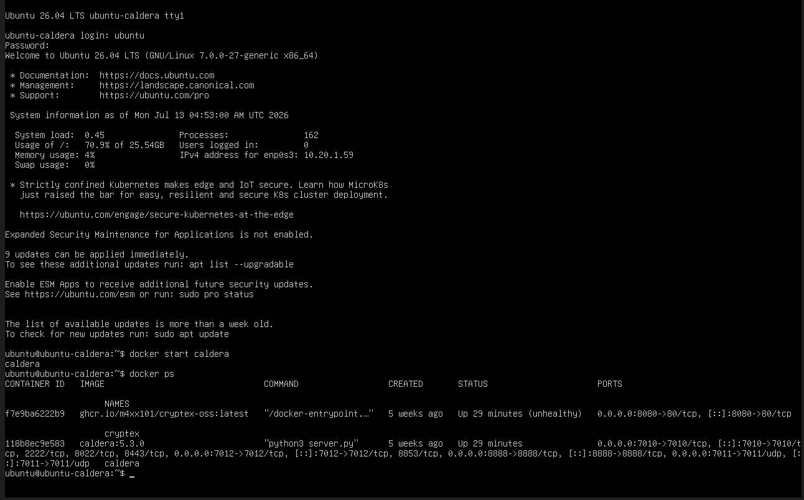
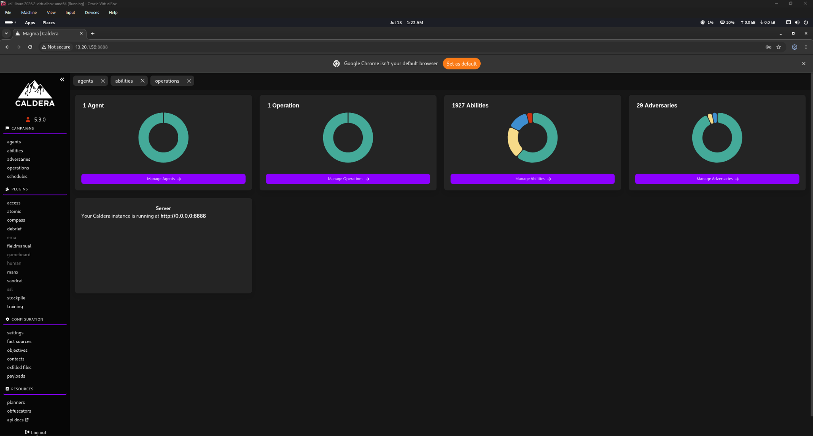
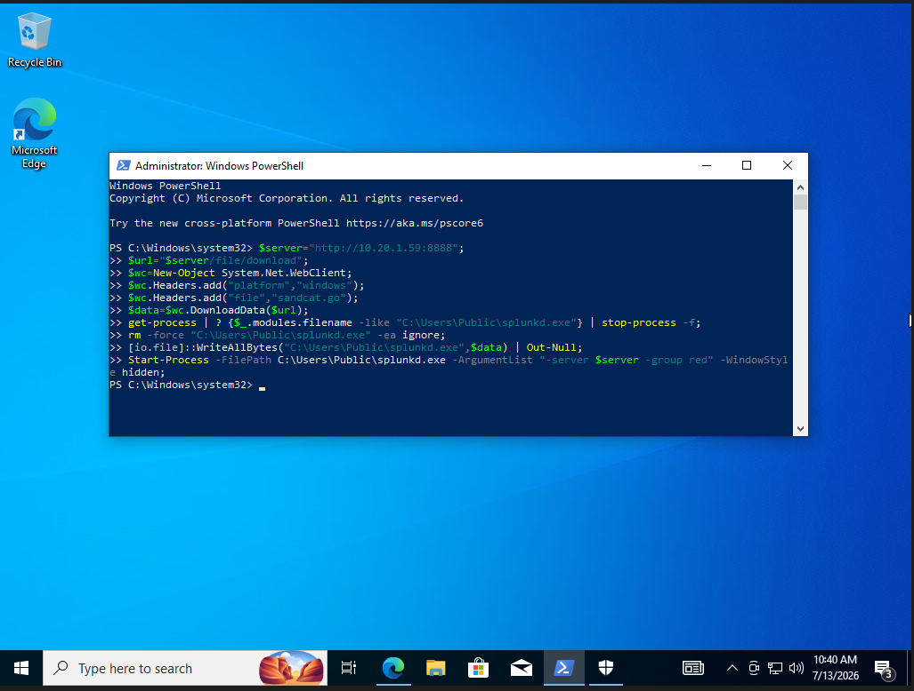
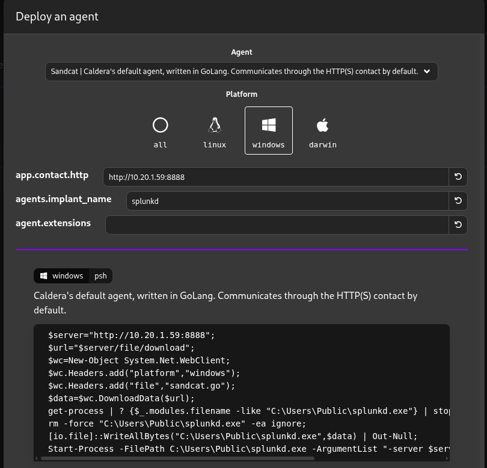
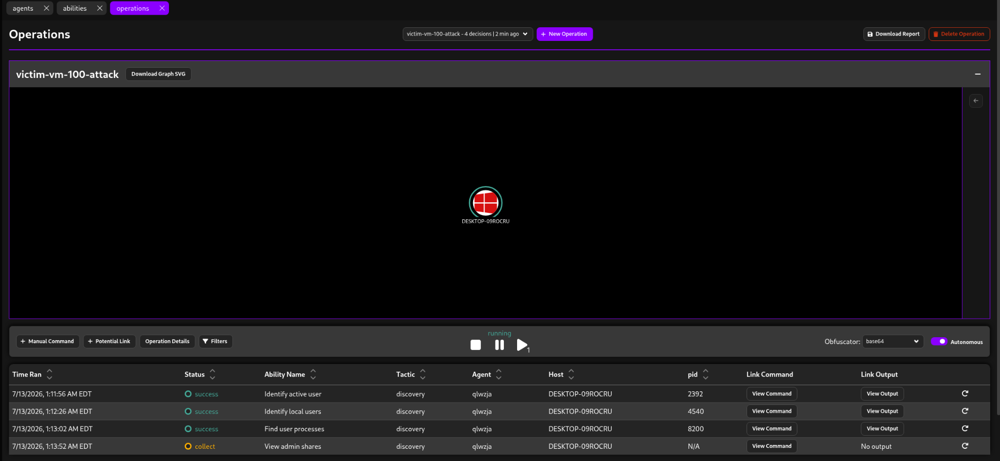
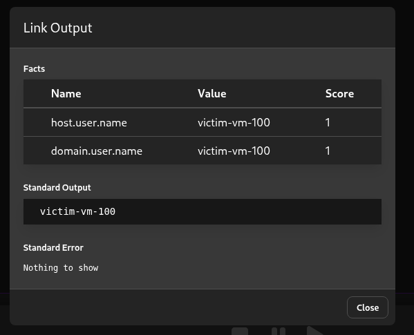
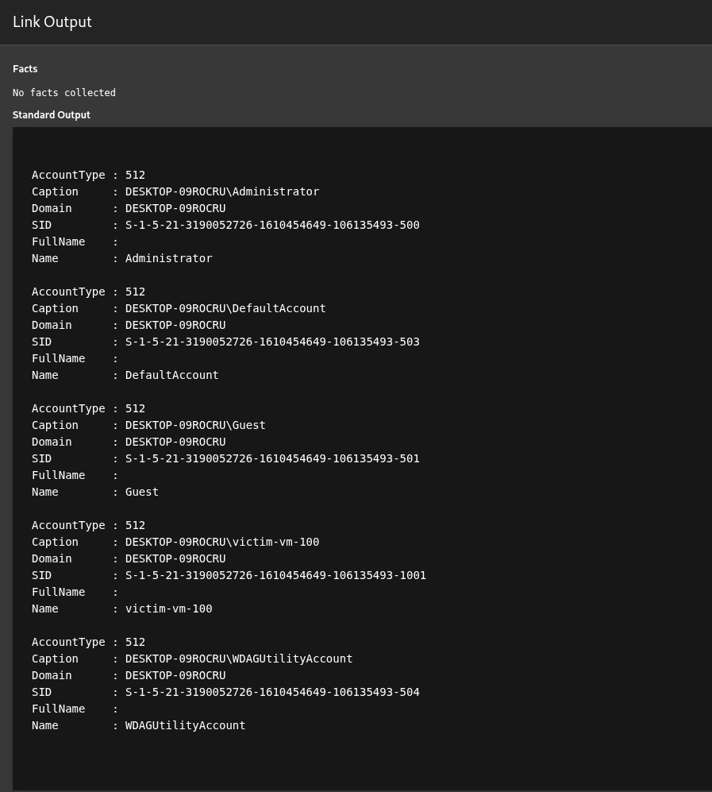
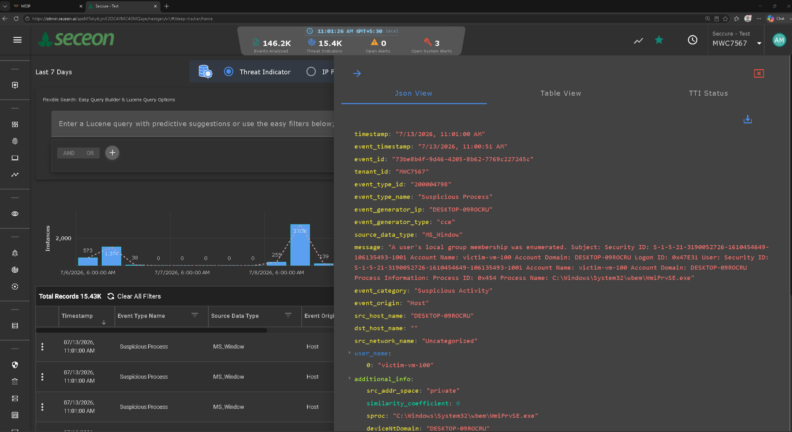

# MITRE Caldera Red Team Lab with Seceon SIEM Detection


---

# 📌 Overview

This project demonstrates an end-to-end **Red Team vs Blue Team** security lab built to validate adversary emulation and detection capabilities.

The lab uses **MITRE Caldera v5.3.0** running inside Docker to simulate attacker behavior against a Windows endpoint. A **Sandcat** agent is deployed to the victim machine, where a **Discovery** adversary profile is executed remotely. Windows Security Events generated during the attack are collected using **NXLog** and forwarded to **Seceon SIEM**, allowing the defensive team to monitor, analyze, and validate detections.

This project demonstrates how offensive security operations can be combined with defensive monitoring to verify detection capabilities.

---

# 🎯 Objectives

- Deploy MITRE Caldera using Docker
- Configure Kali Linux as the attacker workstation
- Deploy Sandcat Agent to a Windows endpoint
- Execute Discovery attack simulation
- Generate Windows Security Events
- Forward logs using NXLog
- Detect attack activity inside Seceon SIEM
- Validate Blue Team visibility

---

# 🖥️ Lab Environment

| Component | Technology |
|------------|------------|
| Docker Host | Ubuntu 26.04 LTS |
| Adversary Emulation | MITRE Caldera v5.3.0 |
| Attacker Machine | Kali Linux |
| Victim Machine | Windows 10 (`victim-vm-100`) |
| Agent | Sandcat |
| Log Forwarder | NXLog Community Edition |
| SIEM | Seceon |
| Virtualization | Oracle VirtualBox |

---

# 🏗️ Lab Architecture

```
                 Kali Linux
              (Attacker Machine)
                      │
                      │
             Caldera Web Interface
                      │
                      ▼
         MITRE Caldera v5.3.0 (Docker)
                      │
              Sandcat HTTP Agent
                      │
                      ▼
        Windows Endpoint (victim-vm-100)
               IP: 10.20.1.171
                      │
            Windows Security Events
                      │
                   NXLog
                      │
                      ▼
                 Seceon SIEM
                      │
                      ▼
        Detection • Monitoring • Analysis
```

---

# ⚙️ Workflow

1. Deploy MITRE Caldera inside Docker.
2. Access the Caldera Web UI from the Kali Linux attacker machine.
3. Generate and deploy the Sandcat agent to the Windows endpoint.
4. Verify the agent successfully checks in to the Caldera server.
5. Execute the **Discovery** adversary profile.
6. Generate Windows Security Events during the attack.
7. Forward endpoint logs to Seceon SIEM using NXLog.
8. Validate detections and analyze the generated events within the SIEM.

# 📸 Step 1 – Deploy MITRE Caldera

MITRE Caldera v5.3.0 was deployed inside a Docker container hosted on Ubuntu 26.04.



---

# 📸 Step 2 – Caldera Dashboard

The Caldera Web Interface was accessed remotely from the Kali Linux attacker machine.



---

# 📸 Step 3 – Deploy Sandcat Agent

A Windows Sandcat agent was generated and executed on the victim endpoint.

The agent established communication with the Caldera server.



---

# 📸 Step 4 – Agent Registration

The Windows endpoint successfully appeared as an active and trusted Sandcat agent.



---

# 📸 Step 5 – Execute Discovery Attack

A Discovery adversary profile was executed against the Windows endpoint.

The attack simulated reconnaissance activities commonly performed by attackers before privilege escalation or lateral movement.



---

# 📸 Step 6 – Operation Results

The operation successfully executed multiple discovery techniques including:

- Active User Enumeration
- Local User Enumeration
- Administrator Share Discovery
- Running Process Discovery



---

# 📸 Step 7 – Command Output

Caldera collected and displayed the command execution results returned by the Sandcat agent.

Collected information included:

- Hostname
- Local Users
- Administrator Accounts
- Running Processes



---

# 📸 Step 9 – Detection in Seceon SIEM

Windows Security Events generated during the Discovery operation were successfully forwarded by NXLog and ingested into Seceon SIEM.

The SIEM dashboard displayed:

- Suspicious Process Activity
- Security Event Logs
- Event Timeline
- Detection Metadata




Detailed event information captured by Seceon SIEM.

The dashboard provides visibility into Windows Security Events generated during adversary emulation.

---

# 🎯 Event Flow

```
Attacker (Kali Linux)
        │
        ▼
MITRE Caldera
        │
        ▼
Sandcat Agent
        │
        ▼
Windows Discovery Commands
        │
        ▼
Windows Security Events
        │
        ▼
NXLog
        │
        ▼
Seceon SIEM
        │
        ▼
Detection & Analysis
```

---

# 🛡️ MITRE ATT&CK Mapping

| ATT&CK Tactic | Description |
|---------------|-------------|
| Discovery | Account Enumeration |
| Discovery | Process Discovery |
| Discovery | Local Group Enumeration |
| Discovery | System Information Discovery |
| Discovery | User Discovery |

---

# 📊 Skills Demonstrated

- MITRE Caldera
- MITRE ATT&CK Framework
- Docker
- Ubuntu Administration
- Kali Linux
- Windows Security
- PowerShell
- Sandcat Agent Deployment
- Red Team Operations
- Adversary Emulation
- NXLog Configuration
- Windows Event Logging
- Seceon SIEM
- Threat Detection
- Detection Engineering
- Security Monitoring
- SOC Operations

---

# 📚 Key Learning Outcomes

- Built a complete Red Team / Blue Team lab environment.
- Deployed MITRE Caldera inside Docker.
- Successfully deployed and managed Sandcat agents.
- Executed adversary emulation using the Discovery profile.
- Generated Windows Security Events.
- Forwarded endpoint logs using NXLog.
- Validated attack visibility within Seceon SIEM.
- Improved understanding of MITRE ATT&CK-based adversary simulation.
- Gained practical experience correlating offensive activities with defensive detections.

---

# 🚀 Future Improvements

- Simulate Persistence techniques
- Simulate Privilege Escalation
- Perform Credential Access attacks
- Execute Lateral Movement scenarios
- Implement Defense Evasion techniques
- Develop custom Caldera adversary profiles
- Integrate Sigma detection rules
- Expand the lab to multiple Windows endpoints
- Automate reporting and detection validation

---

# 📖 References

- https://caldera.mitre.org/
- https://attack.mitre.org/
- https://docs.docker.com/
- https://nxlog.co/
- https://www.seceon.com/

---

# 👨‍💻 Author

**Abhishar Mondal**

M.Sc. Forensic Science (Cyber Security)

SOC Analyst • Threat Detection • SIEM • Digital Forensics • Incident Response • Red Team